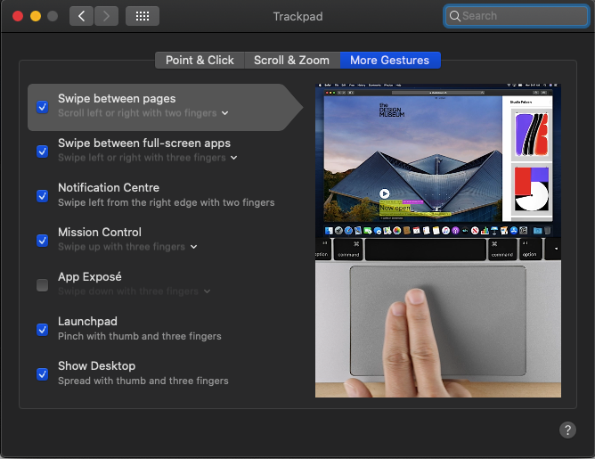

# Acer Nitro 5 AN515-54 Hackintosh

 

## System Details

| Model            | [Acer Nitro 5 AN515-54](https://www.flipkart.com/acer-nitro-5-core-i7-9th-gen-8-gb-1-tb-hdd-256-gb-ssd-windows-10-home-4-graphics-nvidia-geforce-gtx-1650-an515-54-742f-an515-54-76nb-gaming-laptop/p/itm89c6770573582?pid=COMFHNY8BHYY9JKK&lid=LSTCOMFHNY8BHYY9JKKJNZ2PE) |
| :--------------- | :------------------------------------------------------------------------------------------------------------------------------------------------------------------------------------------------------------------------------------------------------------------------- |
| Processor        | Intel i7-9750H                                                                                                                                                                                                                                                             |
| GPU              | Intel UHD Graphics 630 & NVIDIA GeForce® GTX 1650                                                                                                                                                                                                                          |
| Memory           | 2666MHz DDR4 2x8GB                                                                                                                                                                                                                                                         |
| SSD              | 1x Hynix BC501 NVMe SSD 256 GB & 1x WD WDC SATA SSD 256 GB                                                                                                                                                                                                                 |
| Audio            | Realtek ALC255                                                                                                                                                                                                                                                             |
| Touchpad         | ELAN 0504                                                                                                                                                                                                                                                                  |
| BIOS Version     | 1.30                                                                                                                                                                                                                                                                       |
| OpenCore Version | 0.6.0                                                                                                                                                                                                                                                                      |

 

#### Supports MacOS 10.15.x

WiFi is working using [itlwm](https://github.com/OpenIntelWireless/itlwm) and [HeliPort](https://github.com/OpenIntelWireless/HeliPort)

Trackpad is working with full gesture support

 

## Whats not working:

- HDMI 😪😪😪 (won't work because hdmi port is hardwired into GeForce® GTX 1650)
- Nvidia GeForce® GTX 1650
- Bluetooth

 

## Credits

- **Special Thanks** to [dortania](https://dortania.github.io/vanilla-laptop-guide) for the vanilla laptop guide.
- **Special Thanks** to [Acidanthera](https://github.com/acidanthera) for most of the Kexts.
- Thanks to [OpenCore Bootloader](https://https://github.com/acidanthera/OpenCorePkg).
- Thanks to [daliansky](https://github.com/daliansky) for [ACPI Hotpatch Samples for the OpenCore Bootloader](https://github.com/daliansky/OC-little).
- Thanks to [alexandred](https://github.com/alexandred) for [VoodooI2C](https://github.com/alexandred/VoodooI2C).
- Thanks to [hackintosh-stuff](https://github.com/hackintosh-stuff) for [ComboJack support for ALC255](https://github.com/hackintosh-stuff/ComboJack).
- Thanks to [corpnewt](https://github.com/corpnewt) for [GenSMBIOS](https://github.com/corpnewt/GenSMBIOS).
