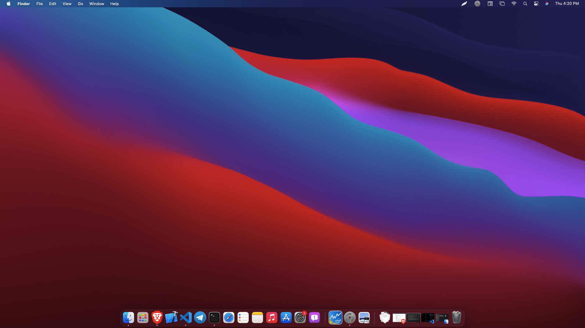
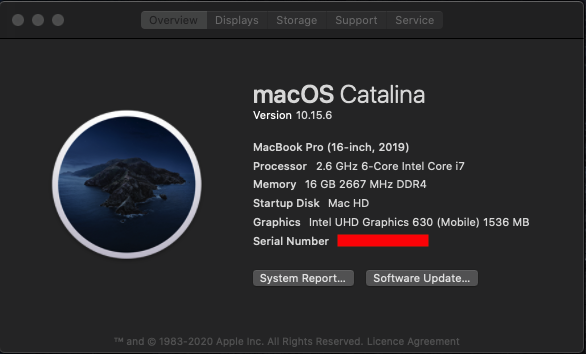

# Acer Nitro 5 AN515-54 Hackintosh

#### Supports macOS Monterey 12.0 Beta (Faced some crashes, so back to BigSur)

 

## System Details

| Model            | Acer Nitro 5 AN515-54                                        |
| :--------------- | :----------------------------------------------------------- |
| Processor        | Intel i7-9750H                                               |
| GPU              | Intel UHD Graphics 630 & NVIDIA GeForce® GTX 1650 (Disabled) |
| Memory           | 2x 2666MHz DDR4 8GB                                          |
| SSD              | 1x Hynix BC501 NVMe SSD 256 GB & 1x WD WDC SATA SSD 256 GB   |
| WiFi / BT        | Intel AC 9560                                                |
| Audio            | Realtek ALC255                                               |
| Touchpad         | ELAN 0504                                                    |
| BIOS Version     | 1.33                                                         |
| OpenCore Version | 0.7.4                                                        |

 

#### Supports MacOS 11.X

 

## Whats not working:

- HDMI 😪 (won't work because hdmi port is hardwired into GeForce® GTX 1650). Don't worry read the note
- Nvidia GeForce® GTX 1650

 

## Note:

If you still want to use an external monitor, you can buy a USB3.0 to HDMI adapter with DisplayLink Chipset.

[Here is a good one](https://www.amazon.in/gp/product/B013G4CJM8/ref=ppx_yo_dt_b_asin_title_o09_s00?ie=UTF8&psc=1)

 

## Credits

- **Special Thanks** to [dortania](https://dortania.github.io/vanilla-laptop-guide) for the vanilla laptop guide.
- **Special Thanks** to [Acidanthera](https://github.com/acidanthera) for most of the Kexts.
- Thanks to [OpenCore Bootloader](https://https://github.com/acidanthera/OpenCorePkg).
- Thanks to [daliansky](https://github.com/daliansky) for [ACPI Hotpatch Samples for the OpenCore Bootloader](https://github.com/daliansky/OC-little).
- Thanks to [alexandred](https://github.com/alexandred) for [VoodooI2C](https://github.com/alexandred/VoodooI2C).
- Thanks to [hackintosh-stuff](https://github.com/hackintosh-stuff) for [ComboJack support for ALC255](https://github.com/hackintosh-stuff/ComboJack).
- Thanks to [corpnewt](https://github.com/corpnewt) for [GenSMBIOS](https://github.com/corpnewt/GenSMBIOS).
- Thanks to [VampFOX67](https://github.com/VampFOX67) for sharing bluetooth fix.
